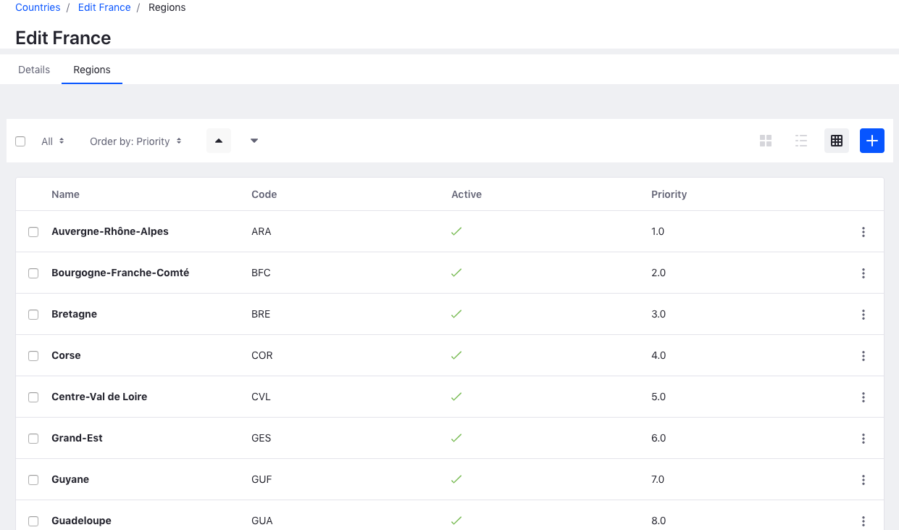

# France Commerce Regions Starter



## Introduction

This module allows you to add France regions automatically when initializing a Liferay Commerce site with an [Accelerator](https://dev.liferay.com/web/commerce/documentation/-/knowledge_base/1-0/accelerators) or when using the _Health Check_ feature (_Site > Commerce > Settings > Health Check > Commerce Countries > Fix issue_).

## Data structure
Regions are stored in a JSON file `regions.json` following this structure:
```
[
  ...
  {
    "priority": 10,
    "code":"IDF",
    "name":"\u00cele-de-France"
  },
  ...
]
```

Each JSON object has 3 attributes:

- __priority__: order in which the region is listed
- __code__: region's code based on ISO 3166 code without `FR-` prefix
- __name__: region's name escaped to Unicode

## Resources

Liferay Commerce Documentation: [Adding Regions To Liferay Commerce’s Country List](https://dev.liferay.com/web/commerce/developer-guide/-/knowledge_base/1-0/adding-regions-to-commerces-country-list)

ISO 3166-2:FR - [wikipedia.org](https://www.iso.org/obp/ui/fr/#iso:code:3166:FR), [iso.org](https://www.iso.org/obp/ui/fr/#iso:code:3166:FR)
